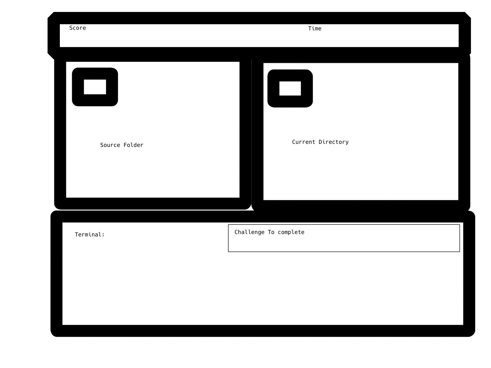

# javascript-terminal-game

This is a mock bash terminal inside a game which when further along will work as a closed space to practice and use bash commands.

Everything is made with **JavaScript/HTML/CSS** from the groundup by me for my 1st General Assembly Project.

### With this You are able to view the directory in gui form as you the folder accessed is changed.

I do Plan on finishing the functionality avaliable at a later date however for now the bash operations avaliable are:

1. cd - includes pathing example: **"cd /home/workspace/git"** includes pathing with **..** and also **cd /** & **cd ~** 
2. ls - includes the same functionality as cd
3. pwd
4. mkdir
5. clear

Other operations in the works are in no certain order: 

- mv
- cp
- general mock git commands

General other features to be added include:

- Pathing live render update
- Tab completion

## Game Rules

Follow the challenge exercises listed before time runs out ever challenge completed adds seconds to the timer and your score returned is higher based on using less commands to complete the requirement listed!

## Thank you and Enjoy!

### Live Version:
[Terminal Game](https://pk-terminal-bash-game.netlify.com/)

### Project Board
[Project Board](https://github.com/greattechpk/javascript-terminal-game/projects/1)

This is the wireframe used for the GUI.

